  

<h1 align="center">🤖 About</h1>

<h2 align="center"><b>Back-end Engineer 🌸 | Jang Tae-mun</b></h2>
<h3 align="center">저는 새로운 발상을 꾸준히 시도하는 개발자 입니다.</h3>

I'm a backend developer who consistently experiments with new ideas.

<h1 align="center">🧰 Main Tech Stack</h1>

  
  
  
  
  
  
  <!-- Discord (일반 로고) -->
  

<h1 align="center">🧪 Sub Tech Stack</h1>

  
  
  
  
  
  
  
  

<h1 align="center">📟 Stats</h1>

  
  

  

<h1 align="center">📬 Contact</h1>

  

  

